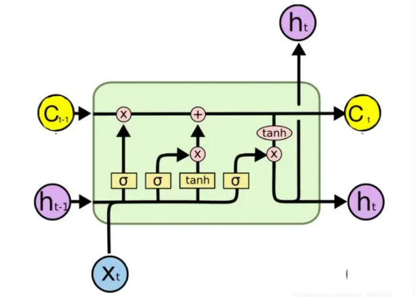
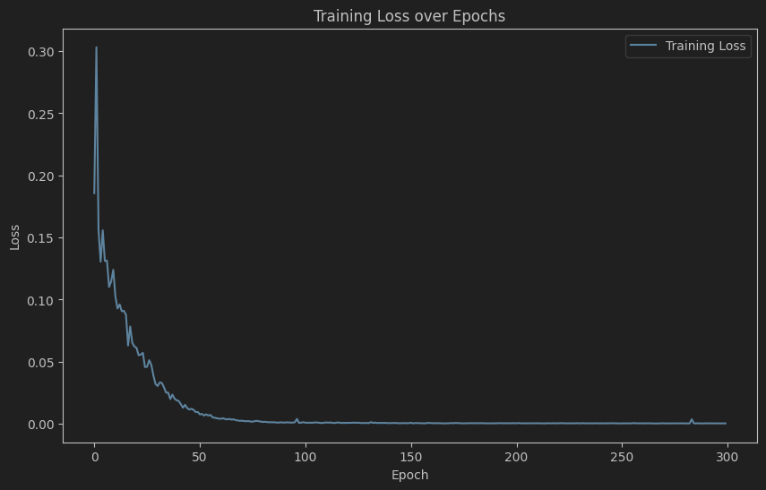
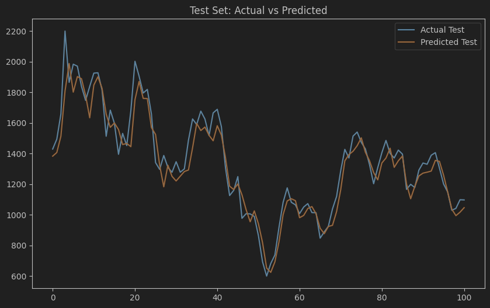
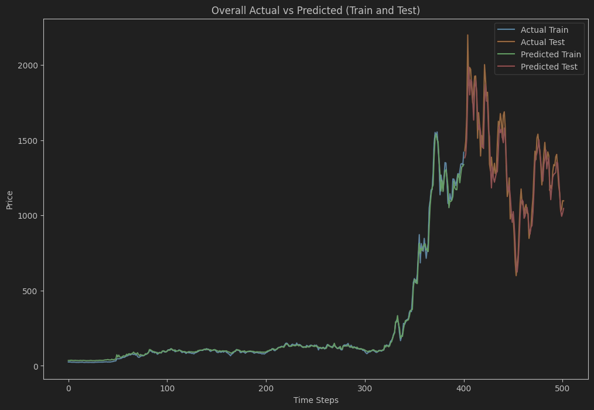

# 🌐 Long Short-Term Memory (LSTM) Documentation

---

## 📘 Overview

In this page, we will introduce the **Long Short-Term Memory Network (LSTM)** model for predicting TSLA stock prices. LSTM is a special RNN that can effectively alleviate the gradient vanishing problem in long sequence data due to its **gating mechanism**. It is particularly suitable for capturing long-term dependencies in time series data and is suitable for long-term trend prediction tasks.
---

## 🧠 Model Architecture

Below is the network architecture of our LSTM model, showing the model hierarchy and the number of neurons and parameter settings for each layer:

 

- **x_i**: Time step sequence features
- **c_t**: The state of the memory cell at time step `t`
- **h_t-1**: Hidden state at time step `t-1`
- **h_t**: Hidden state at time step `t`

### 🔍 Key Configuration Parameters
- **Hidden Units**: 512
- **Layers**: 2
- **Optimizer**: Adam
- **Learning Rate**: 0.001

---

## 📊 Performance Metrics

In order to better quantify the prediction effect of the model, we use the following indicators to evaluate the performance of the LSTM model:

| metric       | value   |
|--------------|---------|
| RMSE  | 98.2126 |
| MAE  | 74.1667 |
| R²     | 0.9090  |

These metrics reflect the prediction accuracy and fit quality of the model in different aspects. **RMSE** and **MAE** measure the prediction bias and error margin of the model respectively, while **R²** shows the model's ability to explain the target variable.
---

## 📈 Training and Validation Curves

In order to observe the stability and generalization ability of model training, we plotted the following curves of training and validation errors versus the number of iterations:

 

This chart shows the error convergence of the model on the training set and the validation set, which can intuitively determine whether the model is overfitting or underfitting.
---

## 📋 Results Analysis

### 1. **RMSE** 

The RMSE of the LSTM model is `98.2126`, which shows that the deviation between the predicted results and the actual values is small, which is in line with the project expectations.

### 2. **MAE** 

The MAE value is `74.1667`, which further supports the effectiveness of the model in error control.

### 3. **R²** 

The coefficient of determination is `0.9090`, which indicates that the model explains 90.90% of the variation in the target variable and is suitable for medium- and long-term forecasting of stock prices.

---

## 🌟 Experimental visualization results

- **Test set visualization**: The model performs well on the test set, and the predicted trend is basically consistent with the actual trend.

  
- **Overall prediction results**: The figure below shows the prediction trend of the LSTM model on the entire dataset, which can effectively capture long-term changes.

---

## 🔗 Access Further Documentation

For more detailed model training, parameter settings, and code examples, please visit the following links:

- [LSTM Model](../LSTM_model.py)

---

> **Tip**: This model is suitable for time series analysis tasks that require long-term dependencies. If you want to further improve the performance of the model, you can try different hyperparameter tuning, increase the number of gated units, or perform feature engineering.