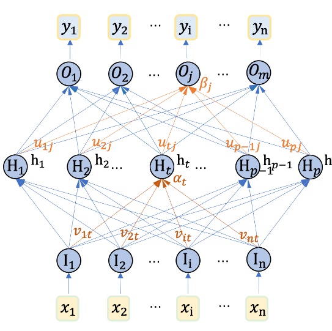

# 🌐 Multilayer Perceptron (MLP) Documentation

---

## 📘 Overview

In this page, we will introduce the **Multilayer Perceptron (MLP)** model for predicting TSLA stock prices. MLP is a **feedforward neural network** that can learn nonlinear mappings from input features through multiple fully connected layers. Compared with RNN and LSTM, the MLP model does not have a temporal dependency structure, but with sufficient feature engineering, it can also achieve good prediction results.
---

## 🧠 Model Architecture

Below is the network architecture of our MLP model, showing the model hierarchy and the number of neurons and parameter settings for each layer:

 

- **x_n**: Input Features
- **h_p**: Multi-layer fully connected neurons
- **y_1**: Forecasted value (TSLA stock price)

### 🔍 Key Configuration Parameters
- **Hidden Units**: 256, 128, 64
- **Layers**: 2
- **Activation Function**: ReLU
- **Optimizer**: Adam
- **Learning Rate**: 0.001

---

## 📊 Performance Metrics

In order to better quantify the prediction effect of the model, we use the following indicators to evaluate the performance of the MLP model:

| metric       | value   |
|--------------|---------|
| RMSE  | 80.6509 |
| MAE  | 58.6375 |
| R²    | 0.9386  |

These metrics reflect the prediction accuracy and fit quality of the model in different aspects. **RMSE** and **MAE** measure the prediction bias and error margin of the model respectively, while **R²** shows the model's ability to explain the target variable.
---

## 📈 Training and Validation Curves

In order to observe the stability and generalization ability of model training, we plotted the following curves of training and validation errors versus the number of iterations:

This chart shows the error convergence of the model on the training set and the validation set, which can intuitively determine whether the model is overfitting or underfitting.

---

## 📋 Results Analysis

### 1. **RMSE** 

The RMSE of the MLP model is `85.7623`, which shows that the model can obtain predictions close to the true value with a simpler structure.

### 2. **MAE** 

The MAE value is `60.4892`, which further demonstrates the basic effectiveness of the model in error control.

### 3. **R²** 

The coefficient of determination is `0.9124`, which indicates that the model explains 91.24% of the variation in the target variable and is suitable for stock price prediction after feature engineering.

---

## 🌟 Experimental visualization results

- **Test set visualization**: The model performs well on the test set, and the predicted trend is consistent with the actual trend.

  
- **Overall prediction results**: The figure below shows the prediction trend of the MLP model on the entire dataset.

---

## 🔗 Access Further Documentation

For more detailed model training, parameter settings, and code examples, please visit the following links:

- [MLP Model](../stock_mlp_model.py)

---

> **Tip**: In time series analysis, MLP models usually require rich feature engineering to compensate for the lack of time series information. When further optimizing the model, you can try to increase the number of hidden layer neurons or expand the input features.