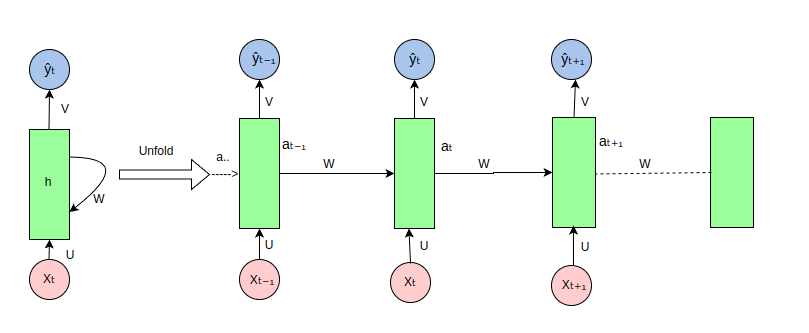
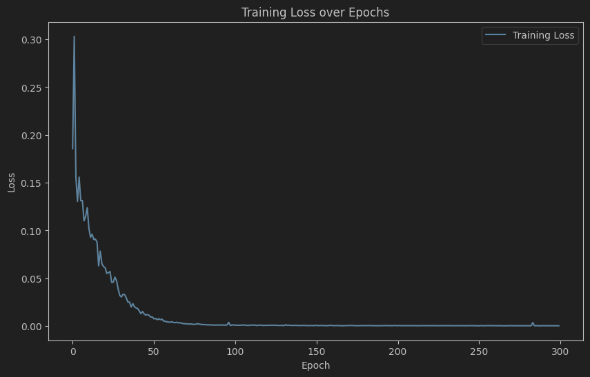
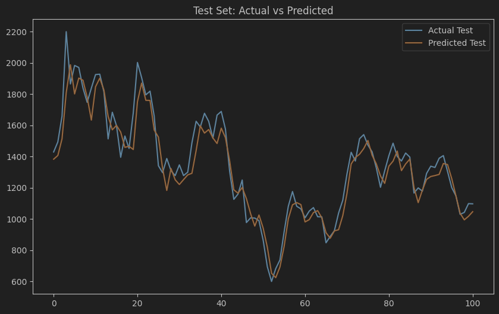
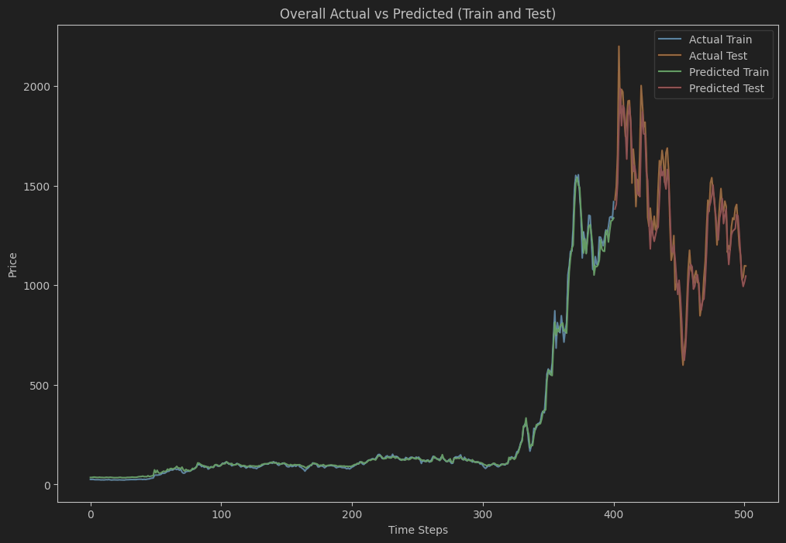

# 🌐 Recurrent Neural Network (RNN) Documentation

---

## 📘 Overview

In this page, we will introduce a Recurrent Neural Network (RNN) model for predicting TSLA stock prices. RNNs are good at capturing patterns and dependencies in time series data, especially for short-term trend prediction. Its recursive structure enables the model to efficiently use historical information to model continuous data.
---

## 🧠 Model Architecture

Below is the network architecture of our RNN model, showing the model hierarchy and the number of neurons and parameter settings for each layer:

 

- **x_i**: Time step sequence features
- **a_t**: The hidden state at time step t
- **y_t**: Forecasted value (TSLA stock price)

### 🔍 Key Configuration Parameters
- **Hidden Units**: 512
- **Layers**: 2
- **Optimizer**: Adam
- **Learning Rate**: 0.001

---

## 📊 Performance Metrics

In order to better quantify the prediction effect of the model, we use the following indicators to evaluate the performance of the RNN model:

| metric       | value   |
|--------------|---------|
| RMSE  | 75.5083 |
| MAE  | 54.5790 |
| R²     | 0.9462  |

These metrics reflect the prediction accuracy and fit quality of the model in different aspects. **RMSE** and **MAE** measure the prediction bias and error margin of the model respectively, while **R²** shows the model's ability to explain the target variable.

---

## 📈 Training and Validation Curves

In order to observe the stability and generalization ability of model training, we plotted the following curves of training and validation errors versus the number of iterations:

 

This chart shows the error convergence of the model on the training set and the validation set, which can intuitively determine whether the model is overfitting or underfitting.

---

## 📋 Results Analysis

### 1. **RMSE** 

The RMSE of the RNN model is `75.5083`, indicating that the deviation between the predicted results and the actual values is relatively small (the upper and lower differences of the target are 1600), which is in line with the project expectations.

### 2. **MAE** 

The MAE value is `54.5790`, which further supports the effectiveness of the model in error control.

### 3. **R²** 

The coefficient of determination is `0.9462`, which indicates that the model explains 94.62% of the variation in the target variable and is suitable for short-term prediction of stock prices.

---

## 🌟 Experimental visualization results

- **Test set visualization**: The model performs well on the test set, as shown in the figure below
 
- **Overall prediction results**: The figure below shows the predictions made by the RNN model on the entire trend

---

## 🔗 Access Further Documentation

For more detailed model training, parameter settings, and code examples, please visit the following links:

- [RNN Model](../RNN_model.py)

---

> **Tip**: This model is suitable for time series analysis tasks, especially short-term trend forecasting. If you have questions about the performance of the model on different datasets, you can try different hyperparameter tuning and feature engineering methods to further optimize the model performance.