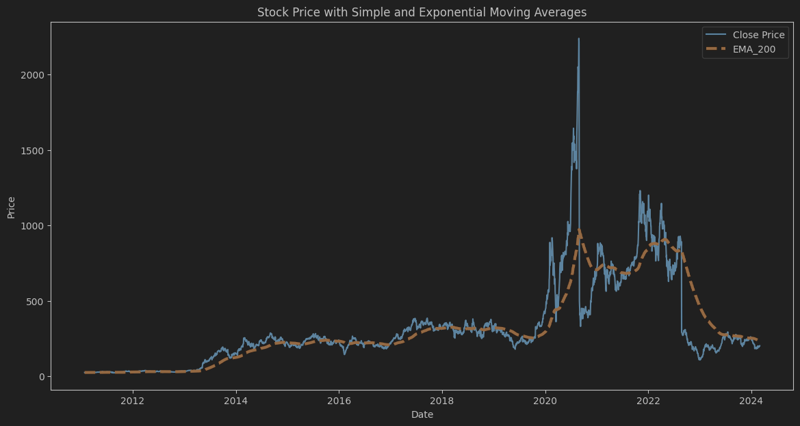
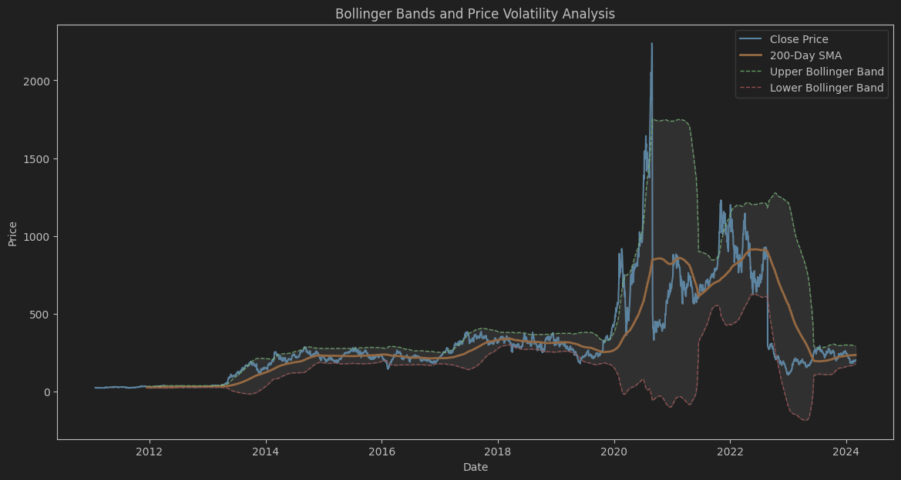
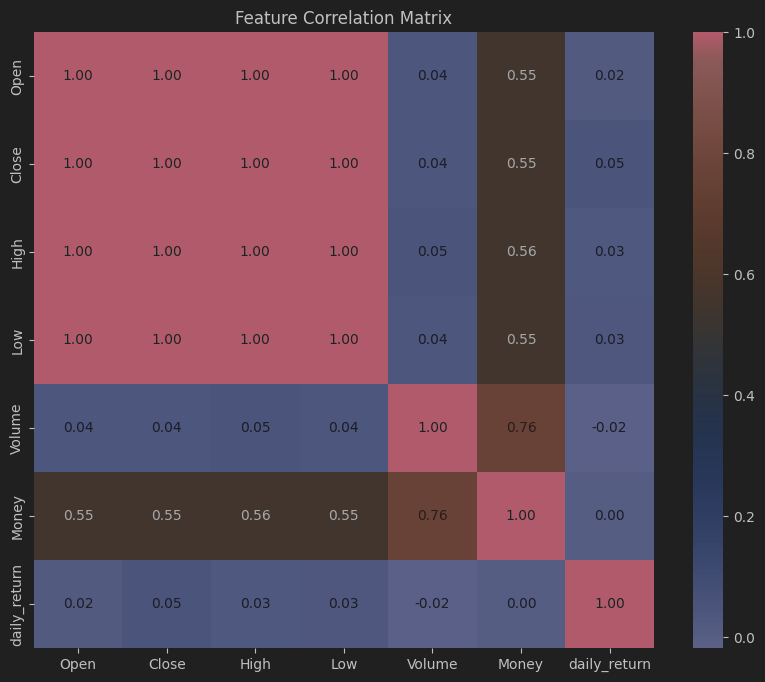
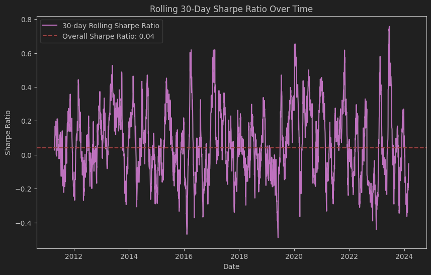

# 📈 Stock Price Prediction using Time-Series Models

 

---

## 📋 Project Overview

In this project, we explore how to use different **time series forecasting models** to predict stock prices. The main contents include data preprocessing, feature engineering, model training and forecast evaluation.

---

## 🔧 Technologies and Tools

- **Python**
- **Pandas**, **NumPy** - Data processing
- **Matplotlib**, **Seaborn** - Visualization
- **scikit-learn** - Machine Learning
- **TensorFlow** / **PyTorch** - Deep Learning
- **LSTM**, **RNN**, **BILSTMN** - Timing Model

---
## 🗂️ Project Structure

The following are the main files and directory structure of the project, which is convenient for understanding the purpose and content of each file:

```plaintext
├── TSLA.csv                # 📂 The original dataset, containing historical data of Tesla stock
├── Data analysis.ipynb           # 📊 Data analysis process, including data cleaning, visualization and feature engineering
├── allmodel.ipynb          # 🧠 Model training and display results, including model performance comparison and evaluation
├── RNN_model.py            # 🔄 RNN model code, suitable for short-term trend prediction
├── LSTM_model.py           # ⏳ LSTM model code to capture long-term dependencies
├── stock_mlp_model.py      # 🔍 MLP model code, using fully connected layers for feature prediction
├── stock_bilstm_model.py   # 🔄 BiLSTM model code, bidirectional LSTM captures more comprehensive sequence dependencies
└── README.md               # 📜 Project Introduction (Current Document)
```
📂 TSLA.csv

The original TSLA stock data file includes features such as date, opening price, closing price, etc. This data is used for subsequent data analysis and model training.

📊 Data analysis.ipynb

It includes cleaning, statistical analysis and visualization of raw data to help us better understand the distribution and trends of data.

🧠 allmodel.ipynb

The main file for model training and result display, including the training process and prediction effect comparison of models such as RNN, LSTM, MLP and BiLSTM. This file helps to intuitively display the model performance through charts and evaluation indicators.

🔄 RNN_model.py & BiLSTM_model.py

RNN_model.py: A classic recurrent neural network model suitable for short-term trend prediction.

BiLSTM_model.py: Bidirectional LSTM model, which can extract richer features from the bidirectional dependencies of data.

⏳ LSTM_model.py

The long short-term memory network model is used to capture long-term dependencies in data and has better adaptability to price trends.

🔍 stock_mlp_model.py

Model file based on a multi-layer perceptron (MLP), suitable for predicting results from feature-engineered inputs.


## 📊 Dataset Overview

The dataset used in this project is **Tesla (TSLA) stock historical data**, which includes the stock's opening price, closing price, highest price, lowest price, trading volume and other features. This dataset provides important historical information for us to analyze and predict stock price trends.
### Data features

- **Date**: date
- **Open**: Opening Price
- **Close**: Closing Price
- **High**: Highest Price
- **Low**: Lowest Price
- **Volume**: Volume
- **Money**: Trading volume on the day
- **prev_close**: Previous day's closing price
- **daily_return**: The daily rate of return is calculated as follows: `(Close - prev_close) / prev_close`


---

## 📈 Data Analysis

In the data analysis phase, we first cleaned and preprocessed the data to ensure the integrity and consistency of the data. Next, through basic statistical description and visual analysis of the data, we revealed the trend and volatility characteristics of TSLA stock prices.

### 1. Basic statistical description

A statistical analysis of the key characteristics was conducted and here are some basic statistics:

<div align="center">

| Feature       | Mean     | Median   | Min      | Max      |
|---------------|----------|----------|----------|----------|
| Open          | 321.98   | 241.35   | 21.93    | 2295.12  |
| Close         | 322.04   | 241.34   | 21.95    | 2238.75  |
| High          | 329.06   | 245.03   | 23.00    | 2318.49  |
| Low           | 314.64   | 236.59   | 21.50    | 2186.52  |
| Volume        | 2.40e+07 | 7.20e+06 | 2.39e+05 | 3.06e+08 |
| Money         | 7.82e+09 | 1.17e+09 | 0.00e+00 | 1.51e+11 |
| daily_return  | 0.0016   | 0.0012   | -0.7748  | 0.2441   |

</div>


### 2. Data trends and seasonality

By analyzing the time series of the data, we found that the price of TSLA stock has an upward trend in a certain period, and there is volatility. The following is a price trend and volatility chart:

- **Price and Exponential Moving Average (EMA) Chart**: It shows the opening and closing prices of TSLA stock, and superimposes the short-term and long-term exponential moving averages (EMA). EMA helps smooth price fluctuations and reveals the overall trend direction of prices.

 


**Bollinger Bands and Price Volatility Analysis Chart**: Bollinger Bands show the price fluctuation range, and the width of the Bollinger Bands reflects the volatility of the price. The Bollinger Bands are wider during high volatility and narrower during low volatility, which helps to identify potential price reversal points.
 

### 3. Feature Correlation

To further understand the relationship between different features, we calculated the feature correlation matrix. The following is the correlation heat map:

<div align="center">
    
</div>

### 4. Sharpe Ratio Analysis

In feature engineering, we introduced the Sharpe Ratio feature to evaluate the risk-adjusted return of returns. The overall Sharpe Ratio is calculated by the ratio of the average daily return to the standard deviation. In addition, we also plotted a 30-day rolling Sharpe Ratio chart to observe the relationship between returns and risks in different time periods.

- 30-day rolling Sharpe Ratio Chart: It shows the changes in the Sharpe Ratio of the 30-day rolling window, which helps to identify the risk-return of TSLA stock under different market conditions.

<div align="center">
    
</div>

---
---

## 🧮 Model Performance Evaluation

In this project, the LSTM model was selected as the baseline model to evaluate the prediction effects of other time series models. The following is the detailed performance of each model:

| 📊 Model              | 🔍 RMSE   | 📉 MAE    | 📈 R²  | 📖 Link                    |
|-----------------------|----------|----------|--------|----------------------------|
| **RNN**               | 75.5083    | 54.5790    | 0.9462 | [View Documentation](document/RNN.md)    |
| **LSTM** *(Baseline)* | 94.3244    | 71.0236   | 0.9160 | [View Documentation](document/LSTM.md)   |
| **BiLSTM**            | 80.8736    | 59.3866    | 0.9383 | [View Documentation](document/BILSTM.md) |
| **MLP**               | 80.6509    | 58.6375    | 0.9386 | [View Documentation](document/MLP.md)    |

---

These indicators help us quantify the error size and fit quality of each model during the prediction process. Among them:

- **RMSE (root mean square error)**: measures the standard deviation between the model's predicted value and the actual value. The smaller the value, the more accurate the prediction.
- **MAE (mean absolute error)**: reflects the average difference between the predicted value and the actual value, which is suitable for directly evaluating the overall level of prediction error.
- **R² (coefficient of determination)**: used to evaluate the degree of explanation of the model for data variation. The closer the value is to 1, the better the model fit is.


In addition, we also explored the impact of different features on the LSTM. The experimental results are shown in the following table:


| 📊 Different features              | 🔍 RMSE  | 📉 MAE  | 📈 R²  |
|-----------------------|----------|---------|--------|
| 'Open', 'High', 'Low', 'Volume', 'Close', 'Sharpe_Ratio'           | 94.3244  | 71.0236  | 0.9160 |
| 'Open', 'High', 'Low', 'Volume', 'Close'             | 101.7636 | 77.5380 | 0.9023 |
| 'Open', 'High', 'Low', 'Close'| 126.5008 | 90.1802 | 0.8490 | 
| 'Open', 'Close'           | 134.9915 | 94.0087 | 0.8280 | 
| 'Close'             | 137.2216 | 96.3752 | 0.8071 | 


---


Through the above evaluation, we found that the **RNN** model performed best in various indicators and is suitable for long-term and short-term trend prediction of stock prices in this project. If you want to view the detailed training process and parameter settings of each model, you can click the corresponding **model document link** to learn more.
---
